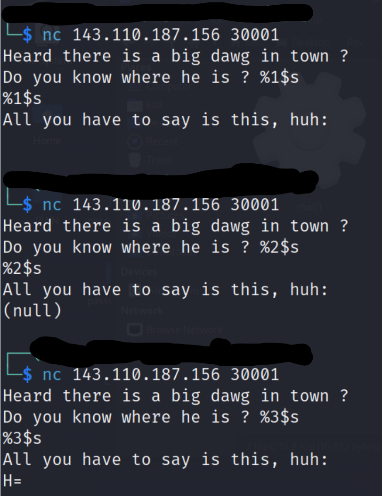

# Challenge Writeup: Exploiting a Format String Vulnerability

## Exploration

In this challenge, we are provided with a file named `chall`. The first step is to identify the file type using the `file` command on Linux. Running the command: `file chall` reveals that it is an ELF executable file.


Our next step is to execute the file and observe its behavior. We do this by connecting to the service using `nc` (netcat) at the provided address: `nc 143.110.187.156 30001`. Upon running the file, we notice that it takes user input and prints something in response. However, the output doesn’t reveal much at first glance, so we proceed to analyze the binary statically to understand its inner workings.


## Static Analysis

So, we need to statically analyze the file, which I did using Ghidra. After loading the ELF file into Ghidra, I navigated to the Decompiler pane to inspect the decompiled code. After cleaning up the code for readability, the code looks as follows:

```C
int main()
{
  FILE * fd;
  char * buffer;
  size_t buffer_size = 0x50;
  char * user_input;

  fd = fopen("./flag.txt","r");

  getline(&buffer, &buffer_size, fd);
  puts("Heard there is a big dawg in town ?");
  printf("Do you know where he is ?");
  scanf("%s", user_input);
  puts("All you have to say is this, huh:");
  printf(user_input);

  return 0;
}
```

Here, I noticed something interesting: `printf(user_input);`. This is an uncontrolled printf statement, which is a common vulnerability known as a **Format String Vulnerability**.

## Understanding the Vulnerability

The function `printf()` expects a format string as its first argument (e.g., "%s", "%d", etc.), but here it is directly using user_input, which means the input provided by the user is treated as the format string. If an attacker provides format specifiers such as `%x` or `%s` (to print stack values) or `%n` (to write to memory), they can potentially read sensitive information from the stack or even modify memory.

For example:

- Inputting `%x` or `%s` will print values from the stack, potentially leaking memory content.
- Inputting `%n` can allow writing to arbitrary memory locations, which can lead to further exploits like code execution.

## Flag Extraction

From the decompiled code, we can see that the file descriptor `fd` is used to hold the flag after it’s opened, and this variable is stored locally within the main function, meaning it resides on the stack. We also note that the format string vulnerability allows us to access specific stack parameters using the `$` sign, for example, `%7$s` refers to the **7th argument** on the stack.

Knowing this, we can start exploring the stack by inputting format strings like `%1$x`, `%2$x`, and so on, to examine values at different positions. After some trial and error, we find that the flag is located at the **7th position** on the stack.

By providing `%7$s` as input, we successfully leak the flag: **H7CTF{f0rm47_s71ng$_4r3_s7!ll_r3l3v4n7}**




## Conclusion

This challenge revolved around a classic Format String Vulnerability where user input is directly passed to `printf()` without validation. By leveraging format specifiers and exploring the stack, we were able to retrieve the flag.

