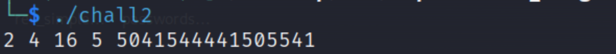

# Exponential Enigma Challenge

## Challenge Overview

In this challenge, we are provided with two files:

1. An ELF binary file.
2. A text file containing a long hexadecimal number.

Our task is to interact with the binary file, figure out what operations it performs, and then use the provided hexadecimal data to calculate or retrieve a flag.

## Initial Analysis

Running the ELF binary, we observe a sequence of numbers being printed. From this, we infer that the binary is likely performing some kind of mathematical operation. To gain a better understanding of the operations, we proceed to load the binary into a static analysis tool, such as Ghidra, and inspect the decompiled code.



## Static Analysis

After loading the ELF file into Ghidra, we clean up the decompiled code for readability. The code looks as follows:

```C
# include <stdio.h>
# include <string.h>
# include <math.h>

unsigned long tetra(int num_1, int num_2)
{
    int counter;
    double pow_result;
    double big_num = 9.223372036854776e+18;
    unsigned long return_value = (unsigned long) num_1;

    for (counter = 0; counter < num_2 - 1; ++ counter)
    {
        pow_result = pow(num_1, return_value);
        if(big_num <= pow_result) 
        {
            return_value = (unsigned long)(pow_result - big_num) ^ 0x8000000000000000;
        }
        else
        {
            return_value = (unsigned long) pow_result;
        }
    }
    
    return return_value;
}

int main(void)
{
    unsigned long int_element;
    size_t reducted_string_length;
    int counter;
    unsigned int int_array [6];
    
    for (counter = 1; counter < 5; ++ counter) 
    {
        int_element = tetra(2, counter);
        int number_1 = 0x13;
        int number_2 = -0x13;
        int_array[counter + -1] = (int)int_element + (int)(int_element / number_1) * number_2;
    }

    for (counter = 0; counter < 4; ++ counter) 
    {
        printf("%d ", (unsigned long) int_array[counter]);
    }

    putchar(10);

    counter = 0;
    while(1)
    {
        char * reducted_string = "REDACTED";
        reducted_string_length = strlen(reducted_string);
        
        if (reducted_string_length <= (unsigned long)(long)counter)
        {
            break;
        }

        printf("%x", (unsigned long) ((int) reducted_string[counter] ^ int_array[counter % 4]));
        counter = counter + 1;
    }

    putchar(10);

    return 0;
}
```

## Code Analysis

**1- Tetra Function:**
The `tetra` function computes a power-based result by raising `num_1` to the power of a progressively increasing number (`return_value`), adjusting the result if it exceeds a large predefined constant (`9.223e+18`). If the result is too large, it performs a bitwise XOR operation to limit the value.

**2- Integer Array Calculation:**
The main function calls `tetra()` four times with increasing values of `num_2`. It uses these results to populate an array called `int_array`.

**3- XOR Obfuscation:**
The program then iterates over the string "**REDACTED**" and XORs each character with a value from `int_array`. The result is printed as a hexadecimal string, suggesting that this might be a simple XOR-based encryption.

To verify that the reverse-engineered code functions correctly, we first need to compile the cleaned-up version of the code. We can do this by using the `gcc` command: `gcc -o enigma.o enigma.c`

This command compiles the `enigma_temp.c` file (which contains our cleaned-up code) and produces an executable named `enigma_temp.o`. Running this executable confirms that the reverse-engineered program produces the same result as the original binary. This ensures that our understanding of the code is accurate and that the reverse-engineering process was successful.


## The Goal

The objective is to reverse the XOR obfuscation in the final step to retrieve the hidden flag. The provided hexadecimal string from the text file can be used in place of the "**REDACTED**" string to uncover the original flag.

## The Solution

We modify the code to replace the "REDACTED" string with the given hexadecimal array and reverse the XOR operation to retrieve the flag. Here’s the updated main function:

```C
int main(void)
{
    unsigned long int_element;
    size_t reducted_string_length;
    int counter;
    unsigned int int_array [6];

    unsigned long given_hex[] = 
    {
        0x4a, 0x33, 0x53, 0x51, 0x44, 0x7f, 0x27, 0x3d, 0x64, 
        0x61, 0x72, 0x66, 0x37, 0x31, 0x21, 0x64, 0x33, 0x62,
        0x22, 0x30, 0x3b, 0x35, 0x21, 0x36, 0x67, 0x30, 0x28,
        0x35, 0x37, 0x62, 0x71, 0x34, 0x3a, 0x37, 0x75, 0x35,
        0x30, 0x30, 0x6d
    };

    size_t given_hex_size = sizeof(given_hex) / sizeof(given_hex[0]);
    char flag[given_hex_size + 1];  // +1 for null terminator.
    flag[given_hex_size] = '\0';    // Null terminate the string.
        
    for (counter = 1; counter < 5; ++ counter) 
    {
        int_element = tetra(2, counter);
        int number_1 = 0x13;
        int number_2 = -0x13;
        int_array[counter + -1] = (int)int_element + (int)(int_element / number_1) * number_2;
    }

    for (counter = 0; counter < 4; ++ counter) 
    {
        printf("%d ", (unsigned long) int_array[counter]);
    }

    putchar(10);

    for (counter = 0; counter < given_hex_size; ++ counter)
    {
        flag[counter] = (char)(given_hex[counter] ^ int_array[counter % 4]);
    }

    printf("Your flag is: %s\n", flag);

    return 0;
}
```

## Flag Retrieval

After running the modified code, the program successfully outputs the flag by reversing the XOR operation using the given hexadecimal array.


## Conclusion

By performing static analysis on the ELF binary, we identified that the program was using mathematical operations and XOR obfuscation to hide the flag. We reversed the obfuscation process using the provided hexadecimal data and successfully retrieved the flag.
