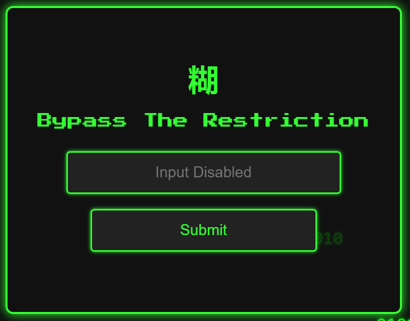
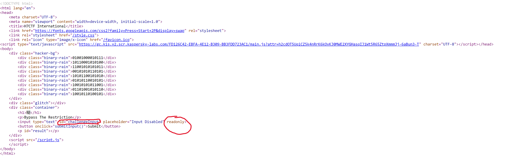
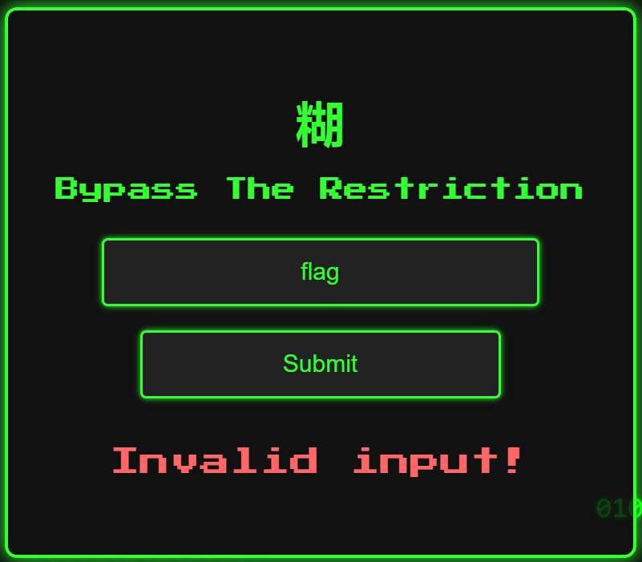
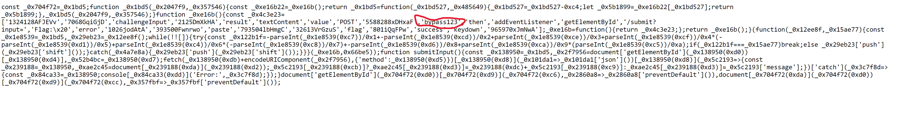
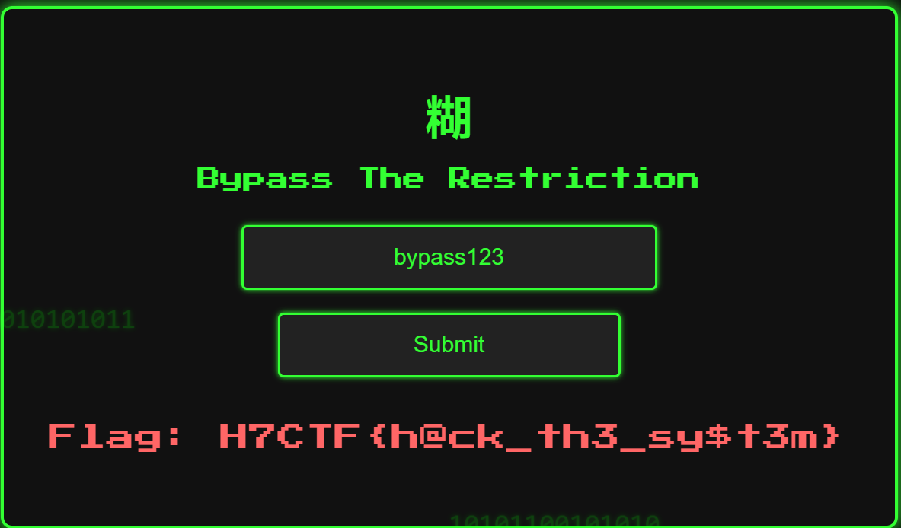

# No Paste

In this challenge, we come across a login web page prompting us to "Bypass The Restriction". 



The first thing to do here is to try playing around with the form by providing inputs to see how it reacts. When we try to give  an input, we notice that not only does it prevent us from pasting, it even restricts us from focusing (interacting/typing) on the input filed. So the next step that comes to mind is to investigate the source code to understand what is going on.

Looking at the page source, we notice a constraint in place set by the **readonly** atrribute. According to the MDN documentation: "The Boolean readonly attribute, when present, makes the element not mutable, meaning the user can not edit the control."



So, we cannot manually edit it as users, but we can programmatically get rid of that restriction by using JavaScript and running it in our browser's console. By targeting the input field by its ID (challengeInput), we set the input value to "flag" to test whether we can bypass the restriction. And voila! We bypassed it, but our input was not the correct one.

```Javascript
function Input()
{ 
    // Remove the readonly attribute.
    document.getElementById('challengeInput').removeAttribute('readonly');
    
    // Set the value of the input to "flag"
    document.getElementById('challengeInput').value = 'flag';
}

Input()
```



So, we need to investigate further to find the correct input. We go back to the page source, but this time we focus on the JavaScript (.js) file. After going through the code, which is mostly obfuscated, we carefully notice a string that says "bypass123".



We go ahead, try it out, and congratulations to us. We made it to the flag!



**The Flag:** H7CTF{h@ck_th3_sy$t3m}
